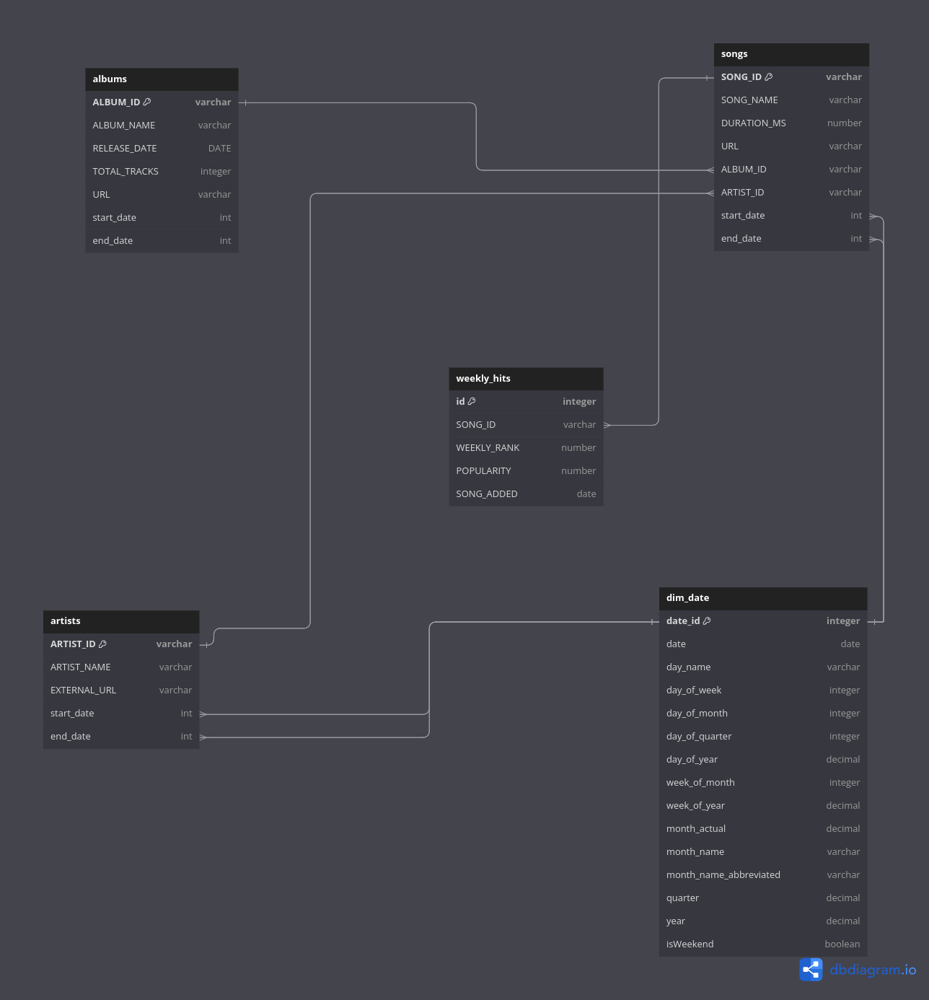

# Data Pipeline :  Spotify API To Snowflake Data Warehouse

This data pipeline automates the process of extracting  **JSON**  data from Spotify API , transforming/flattening it, and loading it into a Snowflake data warehouse in tabular formate.

**Description:**

The pipeline leverages AWS services to achieve the following:

- Schedules a weekly CloudWatch event to trigger the pipeline.
- Extracts data from Spotify API using a Lambda function.
- Stores the extracted data in an S3 bucket.
- Transforms the data using an AWS Glue job.
- Loads the transformed data into Snowflake using Snowpipe.

**Running the Pipeline:**

- The CloudWatch event triggers the Lambda function, initiating the data extraction and transformation process.
- Snowpipe automatically loads the transformed data into Snowflake upon detection.

## **Data Model:**

The Snowflake data warehouse uses a relational data model with the following tables:

**songs:**

| Column Name | Data Type | Description |
|---|---|---|
| SONG_ID | varchar (primary key) | Unique identifier for each song |
| SONG_NAME | varchar | Name of the song |
| DURATION_MS | number(38,0) | Duration of the song in milliseconds |
| URL | varchar | Web address of the song |
| ALBUM_ID | varchar | Foreign key referencing the albums table |
| ARTIST_ID | varchar | Foreign key referencing the artists table |

**artists:**

| Column Name | Data Type | Description |
|---|---|---|
| ARTIST_ID | varchar (primary key) | Unique identifier for each artist |
| ARTIST_NAME | varchar | Name of the artist |
| EXTERNAL_URL | varchar | Web address associated with the artist |

**albums:**

| Column Name | Data Type | Description |
|---|---|---|
| ALBUM_ID | varchar (primary key) | Unique identifier for each album |
| ALBUM_NAME | varchar | Name of the album |
| RELEASE_DATE | DATE | Date the album was released |
| TOTAL_TRACKS | integer | Number of tracks on the album |
| URL | varchar | Web address of the album |

**weekly_hits:**

| Column Name | Data Type | Description |
|---|---|---|
| id | integer (primary key) | Unique identifier for each entry |
| SONG_ID | varchar | Foreign key referencing the songs table |
| WEEKLY_RANK | number | Rank of the song for that week |
| POPULARITY | number | Song popularity score |
| SONG_ADDED | date | date when the song was added to the weekly list |

   

## **Future Enhancement**

 &#9744; Adding CI/CD       
 &#9744;  Creating presentation layer     
 &#9744;   Visualizing data using BI tool like Looker or Power BI      

